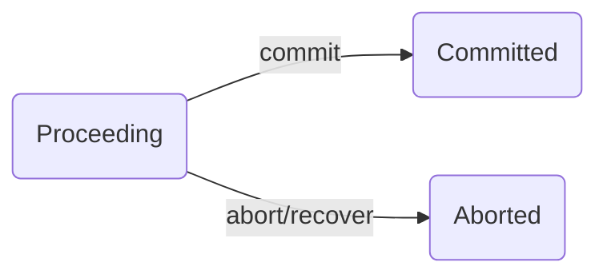

# 项目技术报告

> 麻俊特 19210240038

由于本人主要实现了项目的 TM 部分，本项目报告将从 TM 的角度讲解技术要点与难点。

## Transaction Manager

源码文件为：src/transaction/TransactionManagerImpl.java

主要实现功能：管理事务数据结构。管理事务的生成，事务进行过程中 RM 的加入，以及事务的结束。在系统中会被 RM 调用以将该 RM 加入相应的事务；还会被 WC 调用，以开始事务与结束事务。TM 为独立模块，可在 rmiregistry 启动后，单独启动，WC 模块与 RM 模块都依赖 TM 模块，需要在它启动后再启动。

### 事务数据结构设计

在 TM 中，使用映射（map）的方式存储事务，其中键为事务 ID，值为事务对象。这样可以使得每次查找相应事务对象的时间复杂度均为 O(1)。同时，对于新事务 ID 的分配，我们使用自增 ID 的方式，即每次有新事务申请时，我们为其分配的 ID 为`curID++`。使用这样的方式虽然长期看来会造成 ID 空间的浪费，但逻辑简单明了，新建 ID 的时间复杂度为 O(1)，对于一个小系统来说足矣。并且我们始终会维护一个 log 来记录当前的最大 ID，保证每次重启 TM 后的行为正确性。

我们使用**有限状态机**的方式去模拟一个事务。一个事务具有简单的三个状态：Proceeding，Committed，Aborted。其中 committed 与 aborted 状态为事物的中止状态，不可以再改变为别的状态。状态转移图如下图所示，其中值得注意的是，当 TM 重启执行 recover 的时候，所有正在进行中的事务也需要转移到 aborted 状态。



在该状态机的基础上，事务数据结构还维护着一个 RMID 到 RM 的映射`rm_map`，记录该事务相关的 RM，并在 commit 与 abort 时进行相应的处理。

事务除了上图中改变状态的三个方法之外，还具有以下两个方法：

```java
void enlist(ResourceManager rm);
void terminate();
```

且在不同状态下两个方法具有不同的行为。`enlist`一般是由 RM 调用，告诉 TM 该 RM 与某个事务相关联。在事务为 Proceeding 状态时，`enlist`就会将`rm`加入到该事务的`rm_map`中；当状态为 Commited 时，若该`rm`在`rm_map`中，则调用该`rm`的 commit 函数，并将`rm`从`rm_map`中移除；同理当状态为 Aborted 时，若该`rm`在`rm_map`中，则调用该`rm`的 abort 函数，并将`rm`从`rm_map`中移除。后面两种状态下的 enlist 主要是为了处理 RM 宕机的情况，当宕机的 RM 重连时，TM 通过这种方式告知其需要弥补完成的行为。

`terminate`只能在状态为 Committed 或 Aborted 时调用。当状态为 Committed，`terminate`会调用`rm_map`中所有 RM 的 commit 函数，并将那些 commit 成功的 RM 从`rm_map`中移除，若`rm_map`为空，则将该事务从上层的事务映射中删除。同理 Aborted 时，`terminate`会调用`rm_map`中所有 RM 的 abort 函数，并将那些 abort 成功的 RM 从`rm_map`中移除，若`rm_map`为空，则将该事务从上层的事务映射中删除。总结如下表所示。

| 方法\状态   | Proceeding         | Committed                                        | Aborted                                         |
| ----------- | ------------------ | ------------------------------------------------ | ----------------------------------------------- |
| enlist(rm)  | 将`rm`加入`rm_map` | 若`rm`属于`rm_map`，则调用`rm`的 commit 函数     | 若`rm`属于`rm_map`，则调用`rm`的 abort 函数     |
| terminate() | （无）             | 对于所有`rm`属于`rm_map`，调用`rm`的 commit 函数 | 对于所有`rm`属于`rm_map`，调用`rm`的 abort 函数 |

### 方法实现与容错设计

根据 TransactionManager 接口类，TM 向外外暴露 7 个接口，其中四个核心功能的实现如下所述，在实现过程中我们使用 log 的方式进行了容错考虑。

（**LOG 机制**：我们使 TransactionManagerImpl 类继承 Serializable 接口，使其可以通过 ObjectOutputStream 写入到文件中，每次写入 log，我们就是将该 TransactionManagerImpl 对象写入磁盘上的相应文件，进行覆盖。）

```java
void enlist(int xid, ResourceManager rm); // Invoded by RM.
```

该方法只需调用相应事务（依据 xid）的`enlist`方法即可，事物内部会进行后续操作（详情见[上一章](###事务数据结构设计)）。在该方法的末尾需更新 log。

```java
int start(); // Invoked by WC.
```

该方法需要新建一个 Transaction 对象，并赋予一个事务 ID（分配方法采用自增法）。同样在末尾需要更新 log。

```java
boolean commit(int xid); // Invoked by WC.
```

首先调用对应事务对应的 RM 的 prepare 函数，若所有的 RM 均 prepare，则将事务的状态改为 Committed；否则改为 Aborted。在更新完状态后更新 log。再对所有的 RM 执行`terminate`。

```java
void abort(int xid); // Invoked by WC.
```

将对应事务的状态改为 Aborted，更新 log，再对所有的 RM 执行`terminate`。

本项目的容错主要基于事务的状态机设计以及 LOG 机制。重点容错的三个问题在下面给出解答。

**TM 在被调用 commit 前 fail，如何保证正确性？**首先说明，假如 TM 在被调用 commit 前 fail，则对应事务的状态应该仍然为进行中，而 TM 发生 fail 重启后，fail 前所有进行重的事务都应被 Abort，因此对应的事物的状态应该为 Aborted。在被调用 commit 前 fail，对应事务的状态应该为进行中，由于之前 TM 的所有操作都会将更新 LOG，因此我们可以认定 LOG 中的 TM 与 fail 前的 TM 是同样的。那么，TM 在重启后调用 recover 方法会使得该事务的状态变为 Aborted，并在所有的 RM 重连时调用对应的 abort()操作，从而保证了整个系统的正确性。

**TM 在被调用 commit 后 fail，如何保证正确性？**在 commit 操作后，对应事务的状态已更新并写入 LOG。此时假如在还没有调用所有对应的 RM 的 commit 时 TM 宕机了，系统仍然正确。因为在 TM 重启时，所有的 RM 会重连到 TM 并依据对应的 txid 进行重新调用`enlist`方法。此时由于该事务的状态是 Committed（已写在 log 里，重启时被读出来），所有的 RM 会重新执行相应的 commit()操作，从而保证了整个系统的正确性。

**TM 在调用各个 RM 的 commit/abort 时，RM 出现 fail，如何保证正确性？**在调用各个 RM 的 commit/abort 前，TM 已将对应的事务状态改为 Committed/Aborted，而 RM 出现 fail 再重启 recover 时，与会调用每个相关事务的`enlist`，从而事务再依据状态为 Committed/aborted 调用该重启 RM 的 commit/abort。从而保证了整个系统的正确性。
