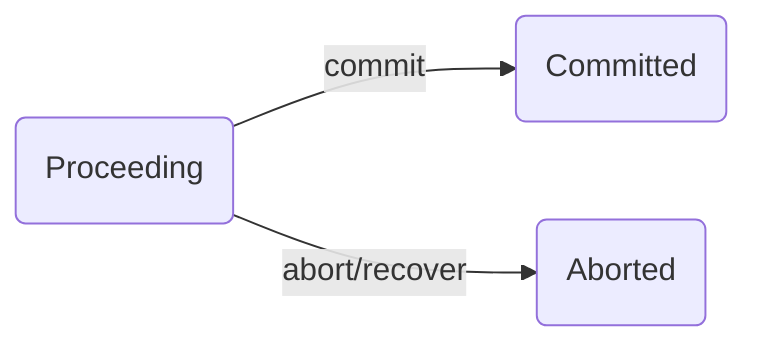

# 项目技术报告

> 麻俊特 19210240038

由于本人主要实现了项目的TM部分，本项目报告将从TM的角度讲解技术要点与难点。

## Transaction Manager 

源码文件为：src/transaction/TransactionManagerImpl.java

主要实现功能：管理事务数据结构。管理事务的生成，事务进行过程中RM的加入，以及事务的结束。在系统中会被RM调用以将该RM加入相应的事务；还会被WC调用，以开始事务与结束事务。TM为独立模块，可在rmiregistry启动后，单独启动，WC模块与RM模块都依赖TM模块，需要在它启动后再启动。

### 事务数据结构设计

在TM中，使用映射（map）的方式存储事务，其中键为事务ID，值为事务对象。这样可以使得每次查找相应事务对象的时间复杂度均为O(1)。同时，对于新事务ID的分配，我们使用自增ID的方式，即每次有新事务申请时，我们为其分配的ID为`curID++`。使用这样的方式虽然长期看来会造成ID空间的浪费，但逻辑简单明了，新建ID的时间复杂度为O(1)，对于一个小系统来说足矣。并且我们始终会维护一个log来记录当前的最大ID，保证每次重启TM后的行为正确性。

我们使用**有限状态机**的方式去模拟一个事务。一个事务具有简单的三个状态：Proceeding，Committed，Aborted。其中committed与aborted状态为事物的中止状态，不可以再改变为别的状态。状态转移图如下图所示，其中值得注意的是，当TM重启执行recover的时候，所有正在进行中的事务也需要转移到aborted状态。



在该状态机的基础上，事务数据结构还维护着一个RMID到RM的映射`rm_map`，记录该事务相关的RM，并在commit与abort时进行相应的处理。

事务除了上图中改变状态的三个方法之外，还具有以下两个方法：

```java
void enlist(ResourceManager rm);
void terminate();
```

且在不同状态下两个方法具有不同的行为。`enlist`一般是由RM调用，告诉TM该RM与某个事务相关联。在事务为Proceeding状态时，`enlist`就会将`rm`加入到该事务的`rm_map`中；当状态为Commited时，若该`rm`在`rm_map`中，则调用该`rm`的commit函数，并将`rm`从`rm_map`中移除；同理当状态为Aborted时，若该`rm`在`rm_map`中，则调用该`rm`的abort函数，并将`rm`从`rm_map`中移除。后面两种状态下的enlist主要是为了处理RM宕机的情况，当宕机的RM重连时，TM通过这种方式告知其需要弥补完成的行为。

`terminate`只能在状态为Committed或Aborted时调用。当状态为Committed，`terminate`会调用`rm_map`中所有RM的commit函数，并将那些commit成功的RM从`rm_map`中移除，若`rm_map`为空，则将该事务从上层的事务映射中删除。同理Aborted时，`terminate`会调用`rm_map`中所有RM的abort函数，并将那些abort成功的RM从`rm_map`中移除，若`rm_map`为空，则将该事务从上层的事务映射中删除。总结如下表所示。

| 方法\状态   | Proceeding         | Committed                                      | Aborted                                       |
| ----------- | ------------------ | ---------------------------------------------- | --------------------------------------------- |
| enlist(rm)  | 将`rm`加入`rm_map` | 若`rm`属于`rm_map`，则调用`rm`的commit函数     | 若`rm`属于`rm_map`，则调用`rm`的abort函数     |
| terminate() | （无）             | 对于所有`rm`属于`rm_map`，调用`rm`的commit函数 | 对于所有`rm`属于`rm_map`，调用`rm`的abort函数 |

### 方法实现与容错设计

根据TransactionManager接口类，TM向外外暴露7个接口，其中四个核心功能的实现如下所述，在实现过程中我们使用log的方式进行了容错考虑。

（**LOG机制**：我们使TransactionManagerImpl类继承Serializable接口，使其可以通过ObjectOutputStream写入到文件中，每次写入log，我们就是将该TransactionManagerImpl对象写入磁盘上的相应文件，进行覆盖。）

```java
void enlist(int xid, ResourceManager rm); // Invoded by RM.
```
该方法只需调用相应事务（依据xid）的`enlist`方法即可，事物内部会进行后续操作（详情见上一章——事务数据结构设计）。在该方法的末尾需更新log。

```java
int start(); // Invoked by WC.
```
该方法需要新建一个Transaction对象，并赋予一个事务ID（分配方法采用自增法）。同样在末尾需要更新log。

```java
boolean commit(int xid); // Invoked by WC.
```
首先调用对应事务对应的RM的prepare函数，若所有的RM均prepare，则将事务的状态改为Committed；否则改为Aborted。在更新完状态后更新log。再对所有的RM执行`terminate`。

```java
void abort(int xid); // Invoked by WC.
```
将对应事务的状态改为Aborted，更新log，再对所有的RM执行`terminate`。

本项目的容错主要基于事务的状态机设计以及LOG机制。重点容错的三个问题在下面给出解答。

**TM在被调用commit前fail，如何保证正确性？**首先说明，假如TM在被调用commit前fail，则对应事务的状态应该仍然为进行中，而TM发生fail重启后，fail前所有进行重的事务都应被Abort，因此对应的事物的状态应该为Aborted。在被调用commit前fail，对应事务的状态应该为进行中，由于之前TM的所有操作都会将更新LOG，因此我们可以认定LOG中的TM与fail前的TM是同样的。那么，TM在重启后调用recover方法会使得该事务的状态变为Aborted，并在所有的RM重连时调用对应的abort()操作，从而保证了整个系统的正确性。

**TM在被调用commit后fail，如何保证正确性？**在commit操作后，对应事务的状态已更新并写入LOG。此时假如在还没有调用所有对应的RM的commit时TM宕机了，系统仍然正确。因为在TM重启时，所有的RM会重连到TM并依据对应的txid进行重新调用`enlist`方法。此时由于该事务的状态是Committed（已写在log里，重启时被读出来），所有的RM会重新执行相应的commit()操作，从而保证了整个系统的正确性。

**TM在调用各个RM的commit/abort时，RM出现fail，如何保证正确性？**在调用各个RM的commit/abort前，TM已将对应的事务状态改为Committed/Aborted，而RM出现fail再重启recover时，与会调用每个相关事务的`enlist`，从而事务再依据状态为Committed/aborted调用该重启RM的commit/abort。从而保证了整个系统的正确性。